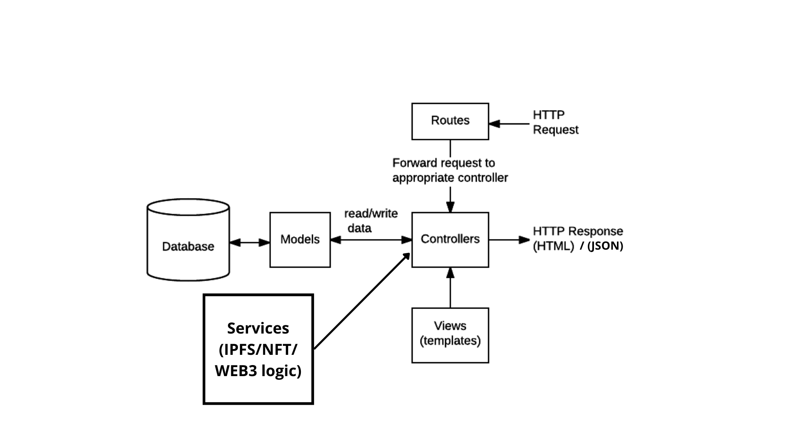
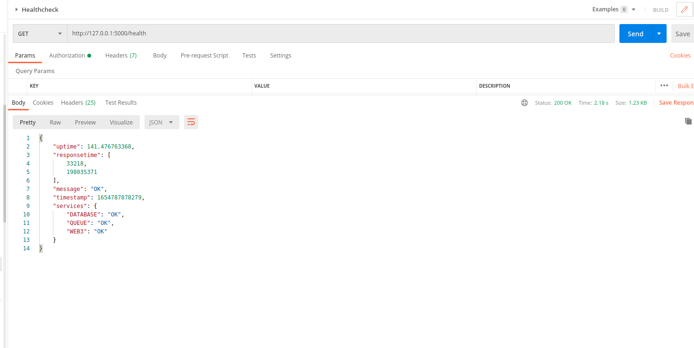

# TEMPLATE_BACKEND_NODE

This is template for nodejs backend

# Requirements

- this code in web 3 and queue releted thing
- Node Version Greater than 14.0.0
- Docker Version 3 and higher
- Eslint configured in your editor

NOTE: The package type of this repo is module means the code is as per ESM format. You cannot use require statements, Instead import and export are used. Please go through ESM docs for more info.

A quick [blog](https://blog.logrocket.com/commonjs-vs-es-modules-node-js/#:~:text=ES%20modules%20are%20the%20standard,encapsulating%20JavaScript%20code%20for%20reuse.) to understand the difference

# Directory Structure

The code structure is made in moduler way and follows MVC architecture.

 
Details of folders are as follows:-

- config: The folder contains index.js file which exports all environment and other important config settings. Please note always export your environment variables from this config file. Don't directly use process.env in code.

- database: This folder contains code to connect to mongodb database and models

- middleware: Middlewares like check api key, rateLimiter etc are put in this folder

- routes: All the endpoints are defined in this folder. The endpoints are bifercated further under multiple users type.

- utilities: This is utilities folder and contains some important utilities used in the project

  - serverUtils:
    - shutDown.js: This contains code for gracefull shutdown of server when you stop it using ctrl+c command or docker-compose down command.
    - healthCheck.js: This contains code for healthcheck of server, this returns whats the status of web3,databse,queue, etc.
  - logger.js : To log data to console and file

- app.js : starting point of application. All express setup and initilizations are done here
- bin/www : Code to create https server and listen to shutdowns
- controllers : Contains code file where we recieve request and send response

# Setup Instructions(Please follow carefully)

## BACKEND SETUP

- Update your docker-compose to latest version, For that a script is there to help you. Run the update_docker.sh bash script(It will do all work for you!)

- .env file is important and should be setup for successfull run of the application. The env-example file is there which contains which fields you have to set. The required one's are PROJECT_NAME, RPC_API and API_KEY. PROJECT_NAME is must as docker containers will be named on this mentioned name and at many other places it is used

- Setup eslint in your editor so that code can be auto formatted when you save any file. For vscode you can refer this [blog](https://daveceddia.com/vscode-use-eslintrc/#:~:text=Configure%20VSCode%20Settings%20to%20use%20ESLint%20for%20Formatting&text=Click%20that%20tiny%20icon%20in,paper%20with%20a%20little%20arrow.&text=The%20first%20one%20turns%20on,it%2C%20we're%20done.)

Please note there are two separate .env required one inside hardhat folder and one for whole project in current folder

# Running instructions

Provide PORT in .env. If not provided server will run at port 3000

## Using Docker

### On Development

- To build `docker-compose -f docker-compose.dev.yaml build`
- To build and run `docker-compose -f docker-compose.dev.yaml up`
- To rebuild and run `docker-compose -f docker-compose.dev.yaml up --build`

### On Production

- To build `docker-compose -f docker-compose.prod.yaml build`
- To build and run `docker-compose -f docker-compose.prod.yaml up`
- To rebuild and run `docker-compose -f docker-compose.prod.yaml up --build`

### Running without docker

- Run MongoDB locally
- Run Rabitmq Locally
- Provide connection url in .env file
- Run npm run dev or npm start

# Important Points To Note

- If server is not able to connect to rabitmq or mongodb in starting, it will start gracefull shutdown of server(GraceFull shutdown means it will close all connections, services and server one by one)

- Health check endpoint is added which will tell you health of server and which services are working fine. You can easily add more services for check by just simply adding it in healthCheck.js file

- Ratelimitter middleware is added to restrict unlimited calls to server from a particular client. Currently it is set for all routes and restriction is 1000 calls per hour. You can modify it as per your requirements

- Logger is improved and should be used at all places

- Standard format of eslint(which doesn't allow ==, ; etc) is used

# Do's and Dont's

- Dont use process.env here and there in your code. If you are creating a new variable put it in config using process.env and then import from config in your code.

- Logger should be used instead of console.log. Give important information using logger.info, logger.warn, logger.error and debug information under logger.debug, logger.silly. Just think console.log = logger.debug

- Don't omit anything in .dockerignore, .gitignore, just append to these files until required

More things will be added soon!!!!
